# Getting Started with Brightcove Video Connect for SharePoint

This guide provides an overview of Brightcove Video Connect for SharePoint, along with installation instructions for the current version. For details of working with Brightcove videos in SharePoint, see [Using the Connector](user-guide.md).

> [!WARNING]
> **Important SharePoint Online (M365) change**
>
> Microsoft is retiring the SharePoint Add-In framework used by the legacy Brightcove SharePoint Connector (Add-In version 4.1.2.0). As a result, the legacy connector will stop working in SharePoint Online (M365) on **2 April 2026**.
>
> To avoid disruption, SharePoint Online customers must migrate to the SPFx-based Brightcove Connector (1.0.0.0). No workaround will be available on the legacy connector after this change. See [Brightcove Video Connect for SharePoint (SPFx)](https://integrations.support.brightcove.com/sharepoint/index.html) on the Brightcove support site for documentation and downloads.
>
> SharePoint **On-premise** customers may continue to use this connector — the retirement applies only to SharePoint Online (M365).
>
> For migration readiness validation, planning, and deployment guidance, please contact your Account Manager or CSM.

## Introduction

| Version | Documentation | Download | Compatibility Notes |
| --- | --- | --- | --- |
| 4.1.2.0 | [Documentation](user-guide.md) | [Plug-in and source](https://github.com/BrightcoveOS/SharePoint-Connector/releases/tag/4.1.2.0) \* | SharePoint 2019 On-premise, SharePoint 2019 Online (Office 365), Brightcove CMS & DI APIs, Brightcove HTML5 Player. Fix: issue with Experiences in certain situations. |
| 4.0.1.0 | No longer supported | EOL | This version of the connector is no longer supported. |
| 3.0.2.0 | Skip to 4.0.x.x release | EOL | No longer supported. |
| 2.0.2.66 | [Training Doc](bc-sharepoint-training.pdf) | EOL | SharePoint 2013/2016 On-premise, SharePoint 2016 Online (Office 365), Brightcove CMS & DI APIs, Brightcove HTML5 Player. |
| 1.1.2.8 | [Training Doc](bc-sharepoint-training.pdf) | EOL | No longer supported. |

For the full list of releases (including patches), see the [GitHub Releases page](https://github.com/BrightcoveOS/SharePoint-Connector/releases).

\* © 2019 Brightcove. Licensed under the Apache License, Version 2.0 — see [LICENSE](../LICENSE).

For help with this connector, please fill out [this worksheet](https://files.brightcove.com/BrightcoveConnectforSharePointSupportWorksheet.docx) and include it with a support ticket to [Brightcove customer support](https://supportportal.brightcove.com/).

## Contents

- [Installing Brightcove Video Connect for SharePoint](#installing-brightcove-video-connect-for-sharepoint)
- [Configuring the Brightcove Video Connect App](#configuring-the-brightcove-video-connect-app)
- [Launching Brightcove Video Connect](#launching-brightcove-video-connect-for-sharepoint)

## Installing Brightcove Video Connect for SharePoint

Before you begin installation, review the following information about prerequisites and permissions:

- Before a user can add an app for SharePoint, a member of the Farm Administrators group must configure the environment to support apps for SharePoint. For more information, see [Configure an environment for apps for SharePoint 2013](https://technet.microsoft.com/en-us/library/fp161236(v=office.15).aspx), [SharePoint 2016](https://technet.microsoft.com/en-us/library/fp161236(v=office.16).aspx), or [SharePoint 2019](https://technet.microsoft.com/en-us/library/fp161236(v=office.16).aspx).
- A user must have the **Manage Web site** and **Create Sub-sites** permissions to add an app for SharePoint. By default, these permissions are available only to users who have the Full Control permission level or who are in the Site Owner's group.
- When a user adds an app for SharePoint, the app requests permissions that it needs to function (for example, access to Search, or to create a list). Users who do not have those permissions are informed that they do not have sufficient permissions and the app cannot be added. The user can contact a Site or farm administrator to see if the administrator can add the app.
- A user logged in to a Site as the system account cannot install an app. The system account cannot import app licenses because that could result in performance problems.

### Adding the Brightcove Video Connect App to the App Catalog

#### Setting up the App Catalog

To install the Brightcove connector, the first step is to set up the App Catalog in SharePoint. Use the references below to complete this step.

- [Manage the App Catalog in SharePoint 2013](https://technet.microsoft.com/en-us/library/fp161234(v=office.15).aspx)
- [Manage the App Catalog in SharePoint 2016](https://technet.microsoft.com/en-us/library/fp161234(v=office.16).aspx)
- [Manage the App Catalog in SharePoint 2019](https://docs.microsoft.com/en-us/SharePoint/administration/manage-the-app-catalog)

#### Adding the Brightcove Video Connect App to the catalog

Once the App Catalog is set up, follow the steps listed below:

1. Verify that the user account performing this procedure is a member of the Site Owners or Designers group for the App Catalog.
2. On the App Catalog Site, click the **Apps for SharePoint** list.
3. On the **Apps for SharePoint** page, click **new item**.
4. In the **Choose a file** box, click **Browse**, and then locate the folder that contains the *BrightcoveConnectorApp* file.
5. Select the App, and then click **Open**.
6. Click **OK** to upload the App.
7. In the Item details box, supply the Name, Title, Short Description, Icon URL, and other settings for the App. Be sure that the **Enabled** check box is selected so that users can see the App in their Sites. You can select the Featured check box to list the App in the **Featured** content view of the App Catalog.
8. Click **Save**.

#### Installing the Brightcove Video Connect App in a Site

Follow the steps listed below to install the Brightcove connector in a Site:

1. Verify that the user account performing this procedure is a member of the Site Owners group.

2. To add the app, go to **Site contents**:

   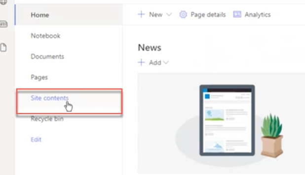

3. Click the **New** dropdown, and select **App**:

   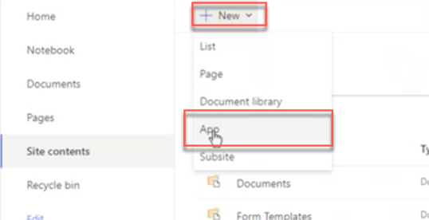

4. In the My apps page, select the Brightcove Video Connector app and click **Add**:

   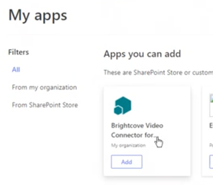

5. In the Grant Permission dialog box, click **Trust it**:

   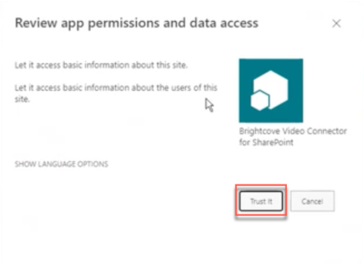

6. The **BrightcoveConnector** App for SharePoint is added and appears in the Apps section of your Site Contents list. It is now available for use in the Site:

   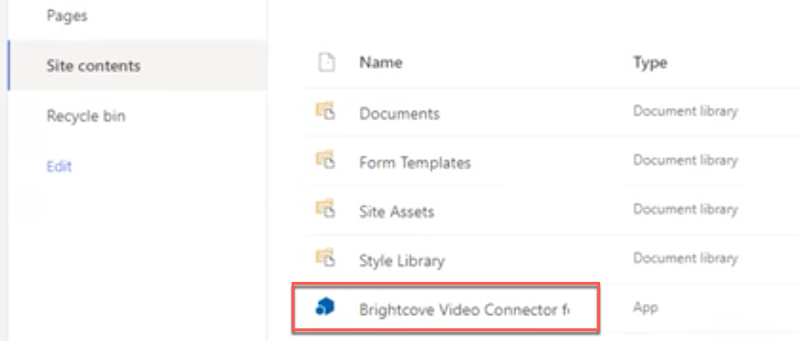

### Configuring the Brightcove Video Connect App

Below are the configuration steps required after the app is added.

1. Click on the Brightcove Video Connector item in the Site Contents list:

   

2. A new page will open, and a message will appear indicating that no accounts are defined — this refers to Brightcove accounts to be used with SharePoint:

   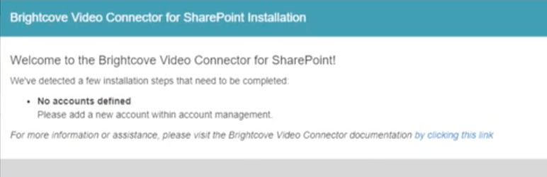

3. Close the message.

4. In the Account Management settings that appear, click on **Add New Account**:

   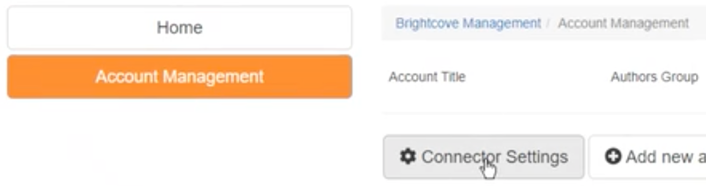

5. In the New Account settings, click the various buttons to enter information about your Video Cloud account. If you don't have the information at hand, you can get it from Video Cloud Studio as indicated below:

   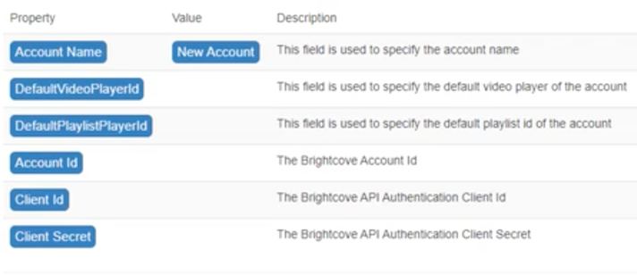

   **Getting information in Studio**

   - **Account Name** and **Account ID** can be found on the Account Information page under Admin:

     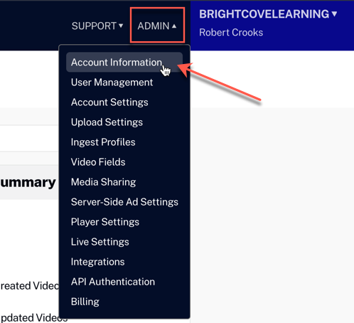

   - **DefaultVideoPlayerID** and **DefaultPlaylistPlayerID** can be found in the Players module:

     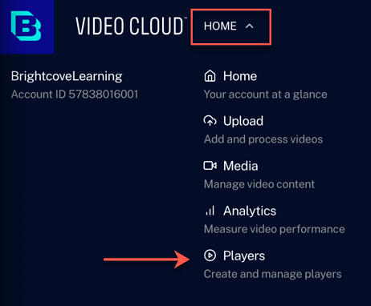

     The player IDs are listed under the names in the players list:

     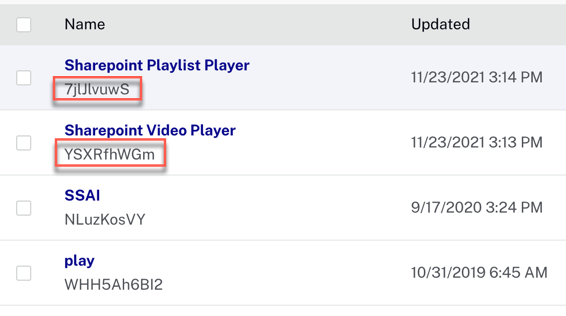

     If you need to create new players for your account, see:
     - [Video Cloud Basics: Creating a Player](https://studio.support.brightcove.com/basics/video-cloud-basics-creating-player.html)
     - [Video Cloud Basics: Creating a Playlist Player](https://studio.support.brightcove.com/basics/video-cloud-basics-creating-playlist-player.html)

   - If you have not already created your **Client ID** and **Client Secret**, go to **API Authentication** under **Admin** in Studio, and follow the instructions in [Managing API Authentication Credentials](https://studio.support.brightcove.com/admin/managing-api-authentication-credentials.html):

     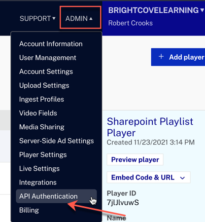

     The minimum permissions you need for your client credentials are:

     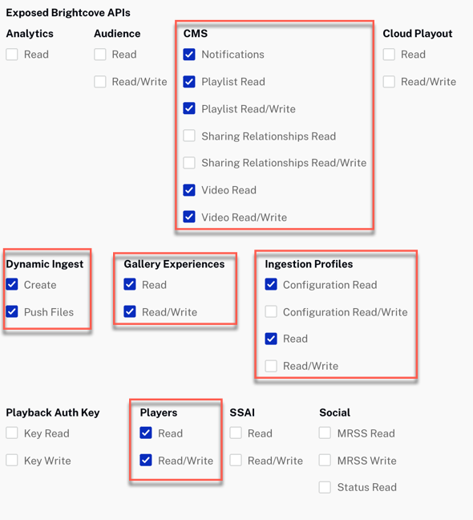

   - For the **Author's Group** and **Viewer's Group**, you can select from the dropdown of SharePoint groups you have defined:

     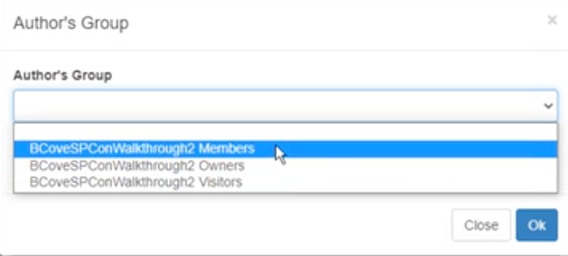

6. After you have entered all the necessary information, click **Save Account**.

> [!NOTE]
> - If you have multiple Video Cloud accounts, repeat the steps above for each one.
> - The same Client ID and Client Secret can be used for multiple accounts. You can select multiple accounts when you initially create the credentials, or edit the credentials later to add additional accounts:
>
>   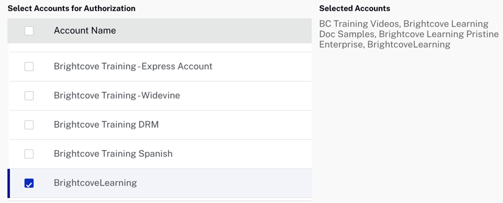

## Launching Brightcove Video Connect for SharePoint

To launch the application, click on the **BrightcoveConnector** App within the Site Contents listing. You will be brought to the Home Page of the Connector App.

The main navigation in the left column is always present and allows the user to navigate all of the sections they have access to. Below is a brief description of the purpose of each component of the Connector:

- **Home** — The landing page when first entering the Connector.
- **Account Management** — Provides the interface for entering the Brightcove Video Cloud account(s) information into SharePoint.
- **Add Videos** — Upload new videos into Video Cloud. A video object is also created in SharePoint (except for the actual video file).
- **Manage Videos** — Browse and edit existing videos as well as import videos from Video Cloud into SharePoint.
- **Manage Playlists** — Create new playlists as well as browse and manage existing playlists.
- **Manage Experiences** — Create and manage In-Page Experiences.

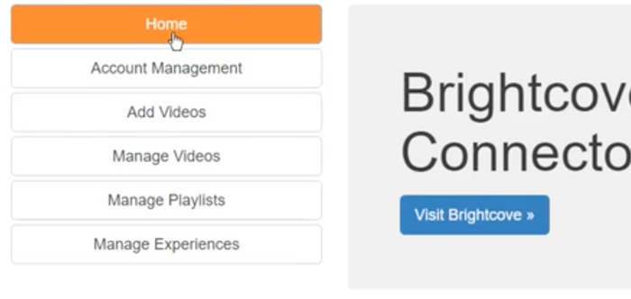

### Account Management Page

The Account Management Page displays the current list of configured accounts, along with the assigned groups for Authors and Viewers.

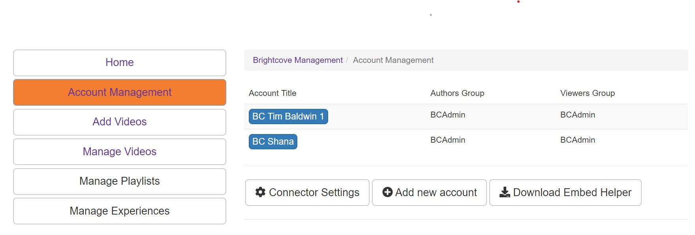

1. **Account Title** — Accounts currently configured (or at least created).
2. **AuthorsGroup** — SharePoint group assigned "Author" rights for the account.
3. **ViewersGroup** — SharePoint group assigned "Viewer" rights for the account.
4. **Add new account** — Open the account creation screen to set up a new account.

---

For day-to-day use of the connector — adding videos, managing playlists, embedding in SharePoint pages — see [Using the Connector](user-guide.md).
