# SharePoint-Brightcove Connector 4.0/4.1: Using the Connector

This guide covers day-to-day use of the Brightcove Video Connect for SharePoint connector: adding and editing videos, managing playlists and Experiences, and embedding video content in SharePoint pages.

For installation and configuration, see the [Install Guide](install.md).

## Adding and Editing Videos

The SharePoint Connector allows a content author to upload videos from their local machine and edit metadata for the videos.

### Add Videos

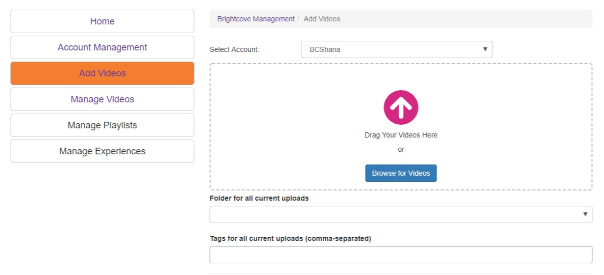

The Add Videos section of the Connector is used to upload new videos into Video Cloud. When a user accesses Add Videos (if they have permission to do so) they are presented with the following fields which enable them to enter the metadata that will be sent to Video Cloud:

- **Select Account** — This dropdown list will be populated with all accounts that the user is authorized to add videos to; this is enabled through the Account Groups assignment. The user must select an account to enable upload.
- **Video File** — Drag video files to the box or click on the **Browse** button to open the local file system explorer to select the video file for upload. This can be repeated multiple times without switching screens. Note that this step must be done after Folder and Brightcove Tags if you want to set them from this screen. You can also edit later.
- **Folder** — Videos can be stored in specific folders for organizational purposes.
- **Brightcove tags** — Data tags that will be saved in the Video Cloud tag information in addition to being saved in SharePoint. These are separate and distinct from SharePoint Metadata tags which some clients will want to add to this interface, and which would only be saved in SharePoint (not transferred to Video Cloud).

When the video finishes processing, an **Edit Video** link will appear, allowing the user to add metadata.

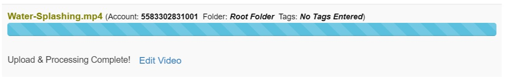

### Edit Videos

The Edit Videos screen can be accessed both through the Edit Video link post-upload or by navigating to Manage Videos and clicking on the desired video.

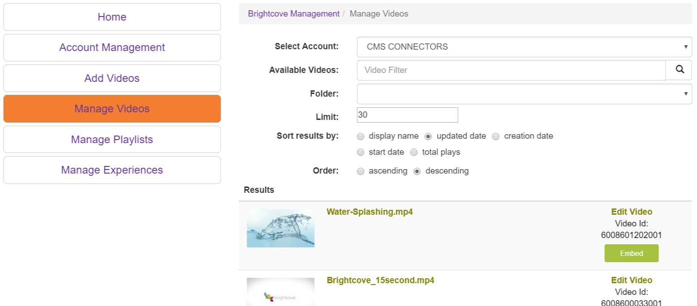

The user can also search videos by typing search words in the **Available Videos** field and choose how to sort the data. Clicking on the name of the video or the **Edit Video** link will take the user to the Edit Video page.

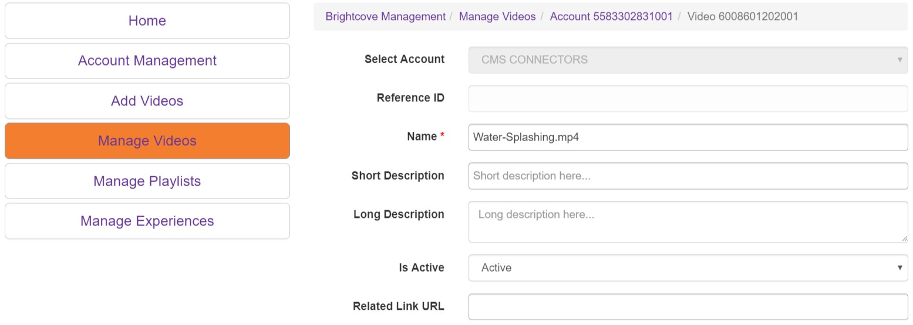

The Brightcove Video Cloud Account the video is uploaded to cannot be changed, but most other information can, including video Name and Descriptions and any custom fields your account includes. The Name is auto-generated from the file name, but it can be changed.

A poster and thumbnail are also generated, but they can be changed here too. There are two ways to change the images. You can capture a new screencap from the video using the capture button in the top right hand corner of the video, or you can simply upload new images.

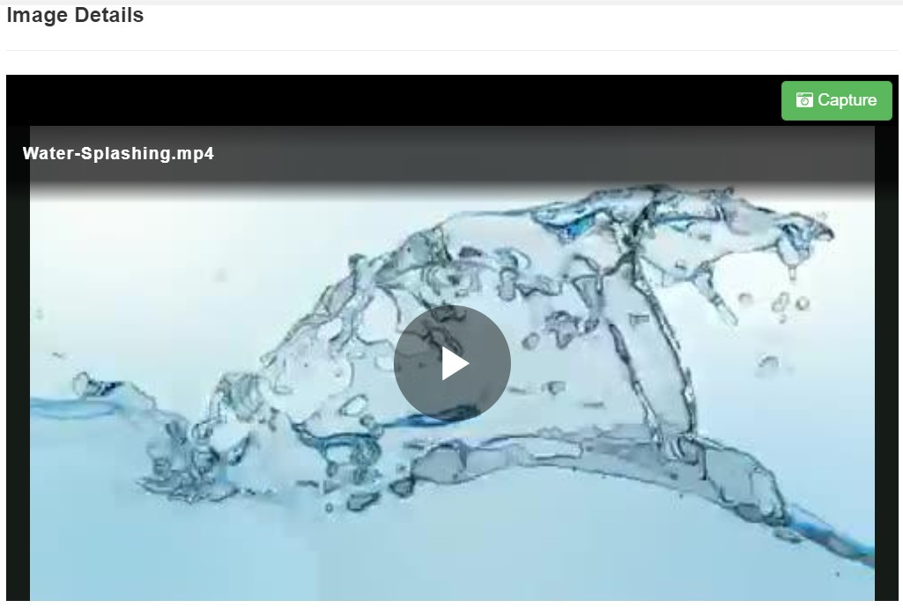

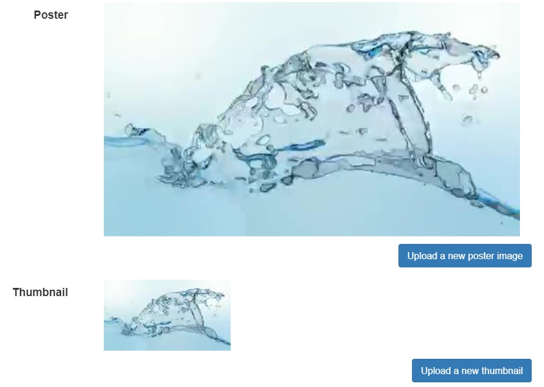

### Adding Text Tracks

Text tracks can be added to any video either on first upload or on subsequent updates. A video can have one or more text tracks associated with it. The user can select the type of text track to be added to the video (File Upload, URL Upload or Remote URL). If **None** is selected, the section will not display any of the fields.

> [!IMPORTANT]
> A single video will **NOT** support a mix of File Uploads, URL Uploads or Remote URLs. Only one type of text track can be associated with each video.

#### File Upload

When **File Upload** is selected for Text Track Files, the following fields are displayed:

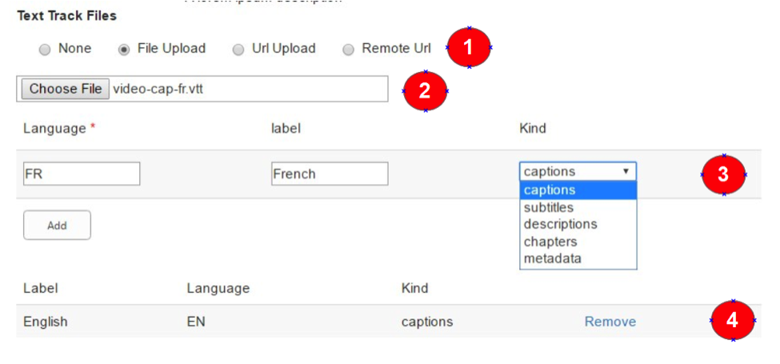

1. **Select Type of Text Track** — Allows for the selection of File Upload, URL Upload or Remote URL.
2. **File Chooser** — Selection of the text track file.
3. **Text Track properties** — Set properties associated with the text track. Clicking **Add** adds the text track to the video data on next upload/update.
   1. **Language** — The two-letter code (valid BCP 47 language tag) for the language of the text track, for example `en` for English.
   2. **Label** — The label for the track that will be visible to the user, such as in a menu that lists the different languages available for subtitles.
   3. **Kind** — One of the five supported track types listed.
4. **List of added/queued text tracks** — Displays the list of existing text tracks and new text tracks that are queued to upload on the next save. A text track can be deleted by clicking the **Remove** link and saving the video.

#### URL Upload, Remote URL Upload

Selecting one of these options replaces the **File Upload** upload with a text field in which to put the fully qualified URL path to the text track file.

- **URL Upload** — Enter the public URL where the text track file resides and then click Upload. The file will be uploaded to Video Cloud.
- **Remote URL** — Enter the public URL where the text track file resides. The URL must be less than 250 characters. Captions will be loaded from the remote URL.

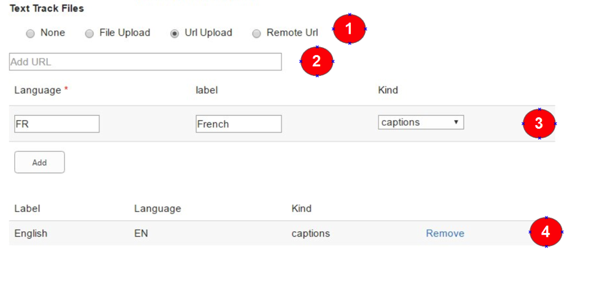

1. **Select Type of Text Track** — Allows for the selection of File Upload, URL Upload or Remote URL.
2. **Add URL** — Field to enter the fully qualified URL path to the text track file.
3. **Text Track properties** — Allows the setting of the properties associated with the text track. Clicking **Add** adds the text track to the video data on next upload/update.
   1. **Language** — The two-letter code (valid BCP 47 language tag) for the language of the text track, for example `en` for English.
   2. **Label** — The label for the track that will be shown to the user, such as in a menu that lists the different languages available for subtitles.
   3. **Kind** — One of the five supported track types listed.
4. **List of added/queued text tracks** — Displays the list of existing text tracks and new text tracks that are queued to upload on the next save. A text track can be deleted by clicking the **Remove** link and saving the video.

## Adding, Importing and Deleting Playlists and Experiences

The Manage Playlists section of the Connector is used to create new playlists as well as browse and manage existing playlists, including editing and updating. Unlike videos, playlist information is not stored in SharePoint, but rather retrieved from Video Cloud each time an account is browsed in this section. For this reason, there are some delays inherent in the availability of playlist data through the API which will be called out in the following sections.

### Manage Playlists Landing Page

The Manage Playlists Landing Page displays the list of the fields that can be used to browse for playlists or create new ones in the available accounts:

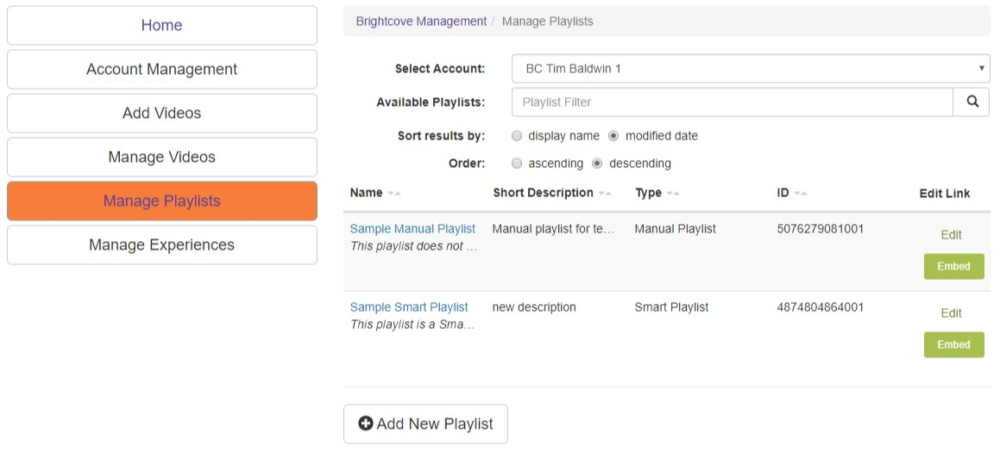

- **Select Account** — This dropdown list will be populated with all accounts that the user is authorized to access; this is enabled through the Account Groups assignment. The user must select an account to view any playlist listings.
- **Available Playlist** — To search playlists, enter terms in this field.
- **Playlist display columns** — Playlist data will be displayed in these columns. The results can be sorted by any column by clicking on the column heading.
- **Playlist listing** — Each playlist listing contains the following:
  - Playlist Name — Clicking on the name will open the playlist for editing of its data.
  - A list of video IDs that are active in the playlist.
  - Short Description.
  - Type of playlist — [Manual or Smart Playlist](https://studio.support.brightcove.com/media/introduction-playlists.html).
  - The ID of the playlist (Video Cloud playlist ID).
  - The **Edit Playlist** link. This link (or clicking on the Name) is used to open the playlist for edit or to view its details.
- **Add New Playlist** — Click this button to create a new playlist in the selected account.

### Adding a New Manual Playlist

To add a new playlist into an account, the user clicks on the **Add New Playlist** button. This opens the Add Playlist form:

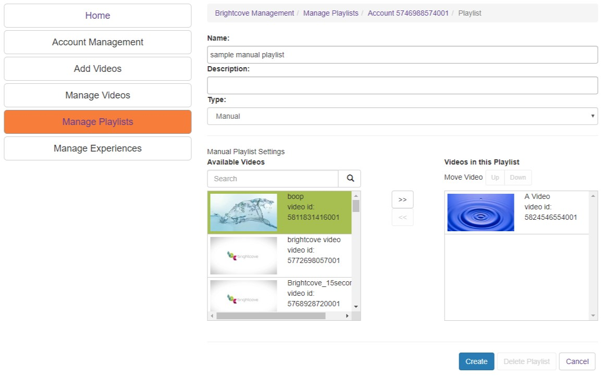

Note that videos can be moved up and down in the playlist by selecting the video to move, and enabling the **Move Video** option to use the Up/Down buttons. Multiple videos can be moved at a time.

- **Name** — The name of the new playlist.
- **Description** — A brief description for the playlist.
- **Type** — The type of playlist. In this case, it should be set to Manual.
- **Available Videos** — Display of the search box and the list of videos available in the account. This allows the user to narrow the video choices to add to the playlist.
- **Action Arrows** — Move selected videos in and out of the playlist.
- **Videos in this Playlist** — The current videos in the playlist are displayed here.
- **Create** — Commit the changes and start the process of creating the new playlist.

### Adding a New Smart Playlist

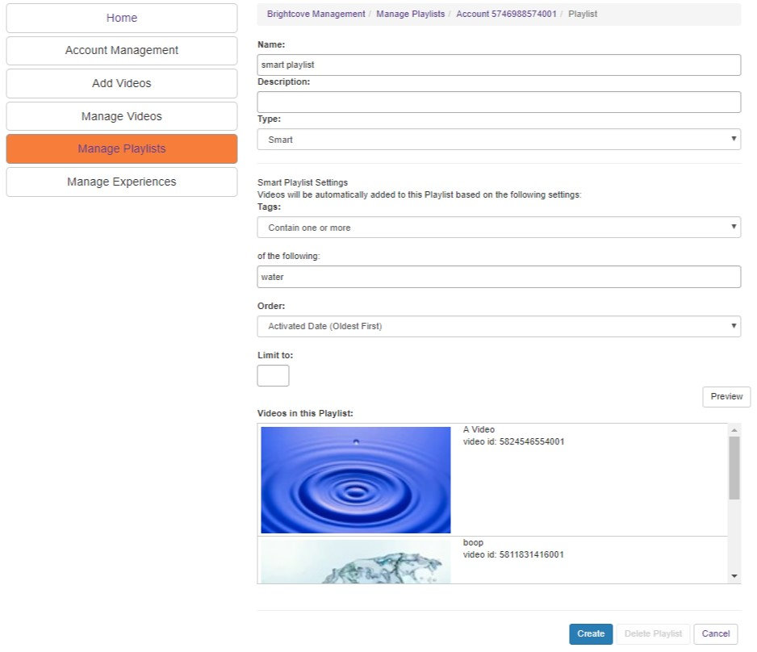

- **Name** — The name of the new playlist.
- **Description** — A brief description for the playlist.
- **Type** — The type of playlist. In this case, it should be set to Smart.
- **Tags** — For a smart playlist, the user can choose one or more tags that can be used to filter a playlist. The first dropdown allows the user to select **Contain one or more** or **Contain all**, and the second dropdown allows the user to enter in the tags for the Smart Playlist. Depending on their selection, either all videos with any of the tags will appear, or only the ones that include all the tags.
- **Order** — This allows the user to specify how the order of the matching videos is set. The selections include the following:
  - Alphabetical
  - Activated Date (newest first)
  - Activated Date (oldest first)
  - Total Plays
  - Trailing Week Plays
  - Start Date (oldest first)
  - Start Date (newest first)
- **Limit to** — The maximum amount of videos to be included in the playlist.
- **Preview** — Click here to view the playlist as it currently functions with the selected options.
- **Videos in this Playlist** — The current videos in the playlist are displayed here.
- **Create** — Commit the changes and start the process of creating the new playlist.

### Editing an Existing Playlist

To edit an existing playlist, click on either the name of the video or the edit link in the far right column on the Manage Playlists page. This will take you to a page that is almost identical to the Add a New Playlist page, but instead of a **Create** button, there is a **Save** button. Almost anything can be edited, except the playlist type. While you can change the type and save it, if you view the playlist again, the changes won't actually have saved.

### Experiences

To view Experiences, click on the Manage Experiences tab. The experiences available will be listed and available. You can view them by clicking on the name, and the Experience can be embedded in pages, but it can only be edited from Brightcove Studio. There is the option to view what the Experience will look like both on a desktop and on mobile, as well as how it looks in various playback states.

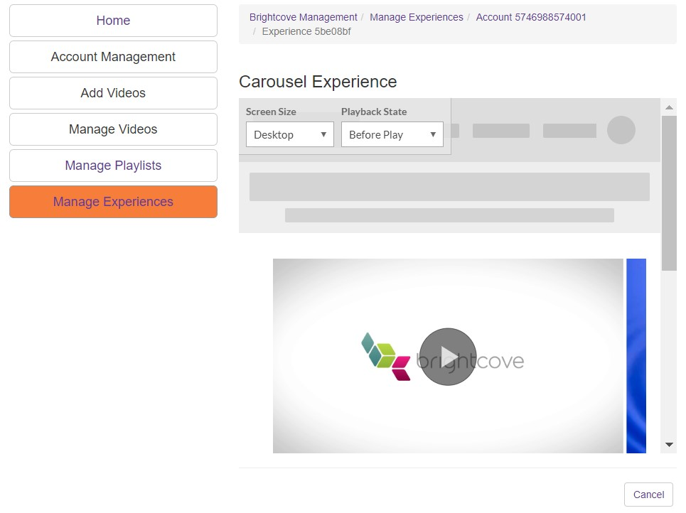

## Adding Video to a SharePoint Site

There are several different ways to embed a video in a SharePoint Site depending on whether you are using the Modern UI or the Classic UI. While the embedding process differs, in both UIs, the process for embedding videos, playlists, and experiences is the same. Simply click on the Brightcove Playlist or Brightcove Experience icon instead of the Brightcove Video icon.

### Modern UI

In the Modern UI, first click on the plus sign to add a new App Part in the desired place. Select Brightcove Video.

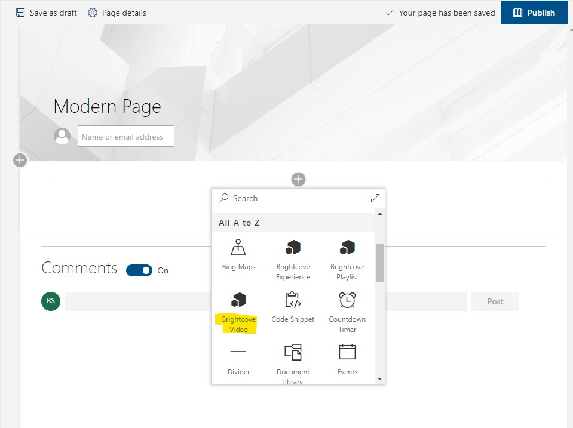

This will open a selection window. Choose a video and then scroll down and click apply.

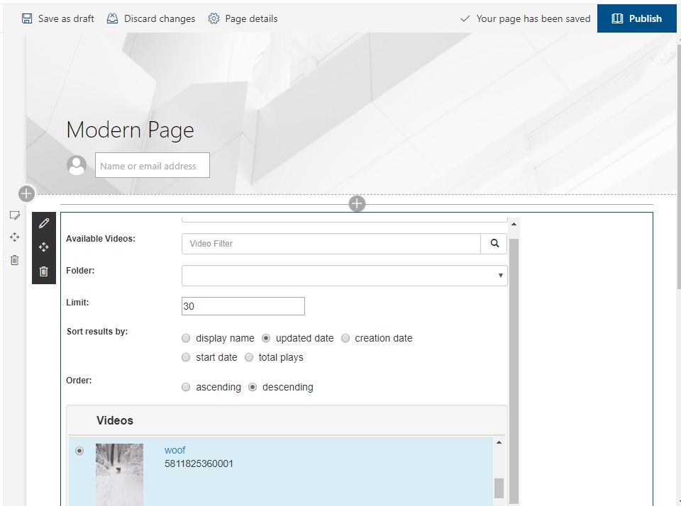

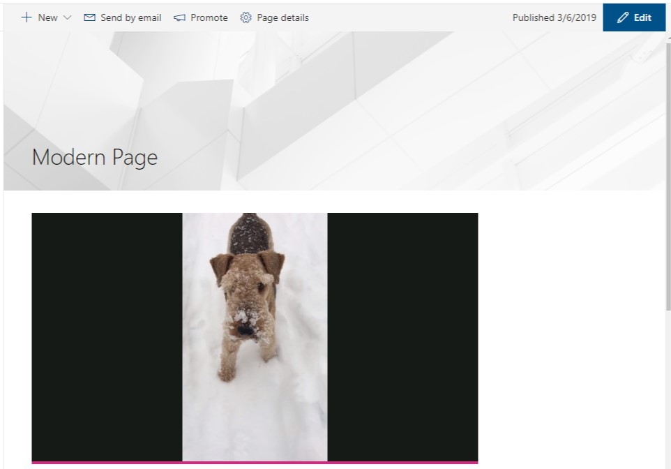

The video will not immediately appear, but clicking **Publish** or **Save as Draft** will show the finished page with the embedded video.

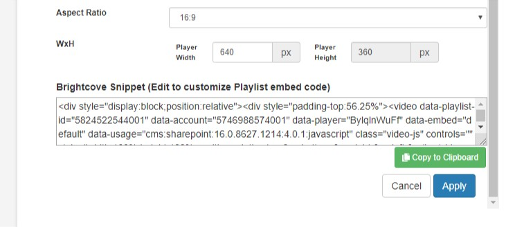

### Classic UI

While the Modern UI only has the one way to embed, the Classic UI has three options. All of them come from the **Insert** menu on the far right of the top toolbar.

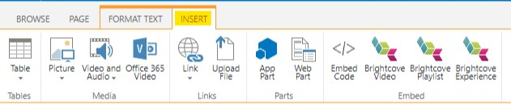

#### Embed

First, click on the Brightcove Video icon. Or, if you are embedding a playlist or an experience, click those. The process is the same.

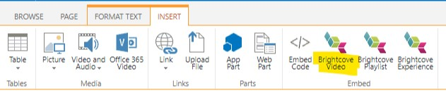

This will open the Brightcove Video selection menu.

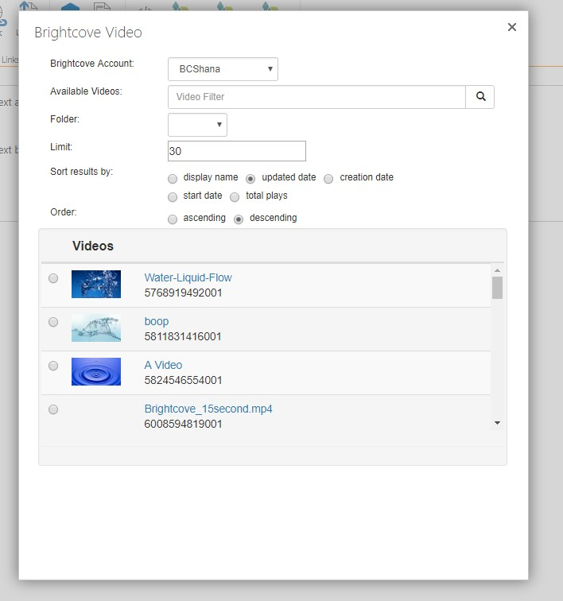

Choose the video, then scroll down and click **Copy to Clipboard**.

Close the Brightcove Video window, then click **Embed** in the Insert menu.

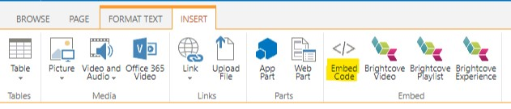

Paste the copied code into the box, then click Insert.

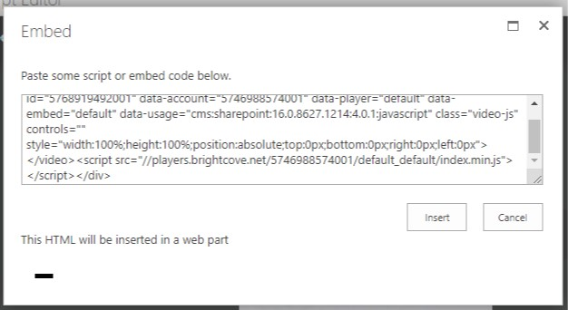

Your video will appear on the page.

#### App Part

To add an App Part, click on the App Part icon.

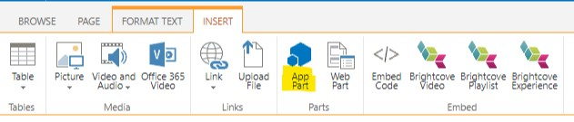

This will open a menu that offers options for different App Parts. Choose the Brightcove Video option.

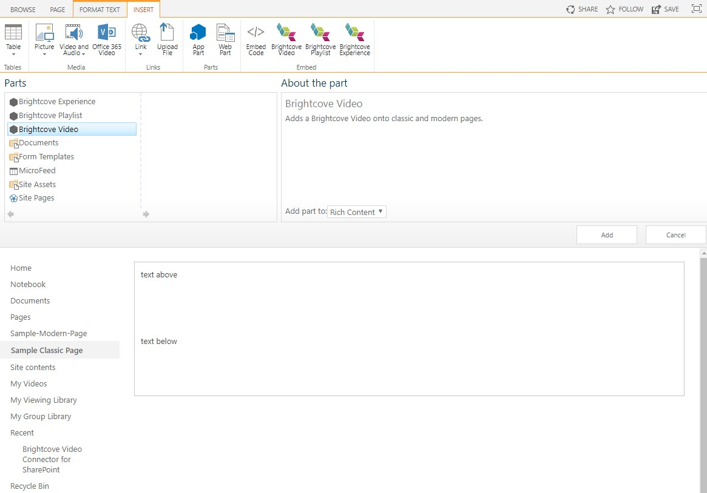

This will add a web part to the page, but initially, there is no video attached.

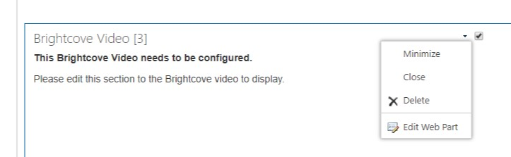

Check the box and click on the arrow to select **Edit Web Part**. This will open the Brightcove Videos and allow you to select a video. Click Apply at the bottom. The video will appear once you save the page.

#### Web Part

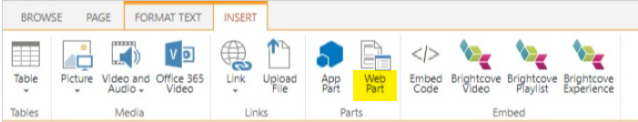

Web Parts can be added one of two ways. Clicking on the Web Parts icon brings up a menu that is similar to the App Part menu, and following the same steps will get the same results.

You can also click the Brightcove Video button again and select a video, but this time choose **Download Web Part**.

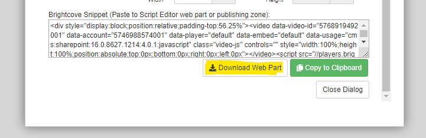

A file will download to your computer. Click on the Web Part icon. When the menu opens up, upload the file to the **Upload a Web Part** field. Click Upload.

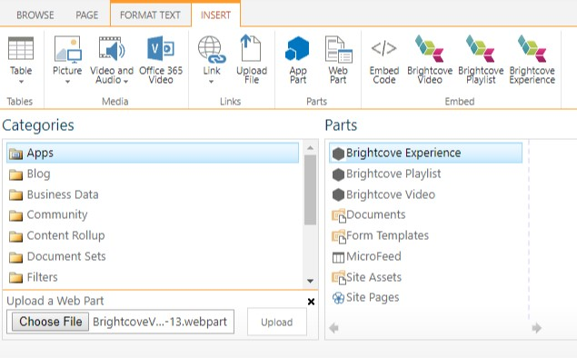

Your video will appear on your page.
